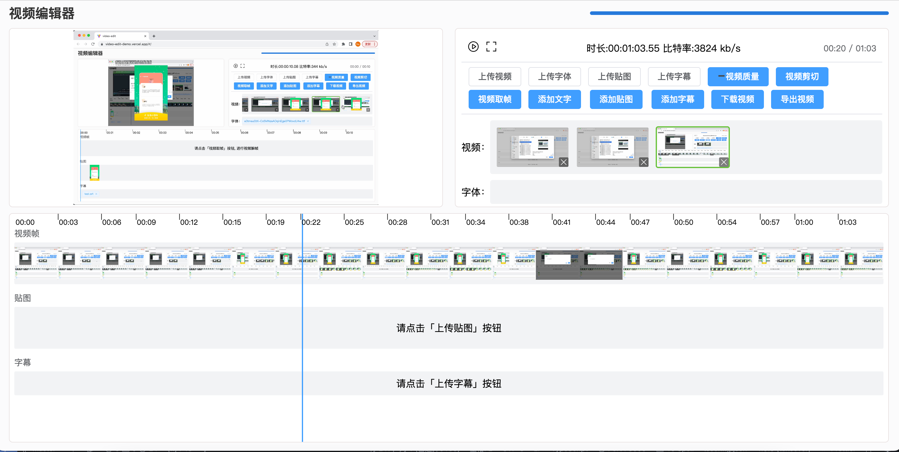

<!--
 * @Author: huhaibiao
 * @Date: 2023-04-21 22:11:20
-->

# 分支说明：
- master:为正式分支，master会不定期合并dev分支
- dev: 为开发分支，如果需要提交，请提交到该分支

# 这个demo框架
- 初步具备：vite 、vue3 、 ts、vue-router 、pinia
- ui框架具备 elementPlus和elementUI按需导入
- 简版的视频编辑器

# 界面


# 项目运行
1. ```pnpm i``` 安装依赖
2. ``` pnpm dev ``` 本地运行
3. ``` pnpm build ``` 项目打包

# 项目demo地址：
`https://video-edit-demo.vercel.app/#/`

# 视频截图方案有两种： 
1. video + canvas
2. wasm + ffmpeg，这里采用这种

# 安装 @ffmpeg/ffmpeg @ffmpeg/core包

`pnpm install @ffmpeg/ffmpeg @ffmpeg/core`

将node_modules/@ffmpeg/ffmpeg/dist中的ffmpeg.min.js拷贝在项目public中使用


# 原理
c/c++视频处理算法库：ffmpeg ->

webassermbly,可在浏览器中运行 ->
       
使用@ffmpeg/ffmpeg @ffmpeg/core这个js库，去对用户上传的视频进行处理


1. 下载 ffmpeg.js

下载 ffmpeg.js 并将其添加到项目中。可以从官方网站（https://ffmpeg.org/download.html#build-windows）下载预编译的二进制文件，或者使用 emscripten 将 ffmpeg 编译为 JavaScript。

2. 使用 ffmpeg.js 处理视频和字幕文件

使用 ffmpeg.js 处理视频和字幕文件。以下是一个示例代码，用于将字幕文件添加到视频中：

```javascript
const ffmpeg = require('ffmpeg.js');

// 读取视频和字幕文件
const videoFile = '/path/to/video.mp4';
const subtitleFile = '/path/to/subtitle.srt';
const videoData = await fetch(videoFile).then(res => res.arrayBuffer());
const subtitleData = await fetch(subtitleFile).then(res => res.text());

// 初始化 ffmpeg.js
const { createFFmpeg, fetchFile } = ffmpeg;
const ffmpegInstance = createFFmpeg({ log: true });
await ffmpegInstance.load();

// 将视频和字幕文件写入虚拟文件系统
ffmpegInstance.FS('writeFile', 'video.mp4', new Uint8Array(videoData));
ffmpegInstance.FS('writeFile', 'subtitle.srt', subtitleData);

// 使用 ffmpeg.js 处理视频和字幕文件
await ffmpegInstance.run('-i', 'video.mp4', '-vf', 'subtitles=subtitle.srt', 'output.mp4');

// 从虚拟文件系统中读取输出文件
const outputData = ffmpegInstance.FS('readFile', 'output.mp4');

// 将输出文件保存到本地
const outputBlob = new Blob([outputData.buffer], { type: 'video/mp4' });
const outputUrl = URL.createObjectURL(outputBlob);
const link = document.createElement('a');
link.href = outputUrl;
link.download = 'output.mp4';
document.body.appendChild(link);
link.click();
```


# done
- 开启worker多线程，处理视频
- 视频分割，一分为2，剪切视频 ✅
- 视频每秒分帧 ✅
- 上传视频 ✅
- 视频时间轨道 ✅
- 数据结构优化 ✅
- 视频导出功能 ✅
- 界面优化完成 ✅
- 字幕功能测试（没有生效）
- 贴图按时间显示 ✅
- 弹窗面板组件开发
- 视频分帧与时间刻度对应 ✅
- 解决视频小于20秒的情况下分帧: tick刻度生成/视频帧生成/ ✅
- 视频帧随视频切换动态更新 ✅
- 上传视频至服务器(模拟) ✅
- 配置部署 ✅
- 加载ffmpeg-core状态添加 ✅
- 视频时间刻度点击对其bug修复 ✅
- 超过2G视频兼容不处理 ✅
- 右侧按钮优化 ✅

# ffmpeg命令：

使用FFmpeg命令行工具从视频中抽取单个帧的示例命令：
```
ffmpeg -i input.mp4 -ss 00:00:05 -vframes 1 output.jpg
```

从视频中抽取多个帧命令：
```
ffmpeg -i input.mp4 -ss 00:00:05 -frames:v 10 output_%03d.jpg
```

每 5 秒抽一帧，可以使用以下命令：

```
ffmpeg -i input.mp4 -r 0.2 -vf "select=not(mod(n\,100)),scale=-1:240,tile=3x4" output.jpg
```

# 内存限制
2 GB，这是 WebAssembly 中的硬性限制

超出会报： Error: File could not be read! Code=0
    at fileReader.onerror
